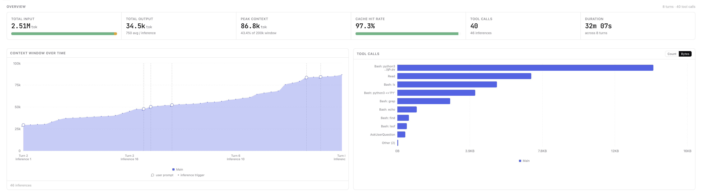

<h1 align="center">agent-profiler</h1>
<p align="center">
  <a href="https://www.npmjs.com/package/@ghostship/agent-profiler"></a>
  <a href="https://www.npmjs.com/package/@ghostship/agent-profiler"></a>
  <a href="./LICENSE"></a>
</p>
<p align="center"><code>npx @ghostship/agent-profiler</code><br />or <code>npm i -g @ghostship/agent-profiler</code></p>
<p align="center"><strong>agent-profiler</strong> is a local, open-source trace viewer for agent harness sessions.</p>
<p align="center"><strong>Support for </strong> Codex, Claude Code and <a href="./docs/adding-agent-harness-adapter.md">an adapter can be added</a> for any harness</p>
<p align="center">
  
</p>

<table width="100%">
  <tr>
    <td width="100%" align="center"><strong>Trajectory View</strong><br /><em>See what tool calls what tools were called and how they impacted the context window</em><br /><br /></td>
  </tr>
  <tr>
    <td width="100%" align="center"><strong>Flow View</strong><br /><em>Use a directed graph to see what subagents and skills were spawned and with what context.</em><br /><br /></td>
  </tr>
  <tr>
    <td width="100%" align="center"><strong>Summary View</strong><br /><em>Tool call leaderboard to identify which steps get repeated every session that could be lifted into a skill, doc, or cached lookup.</em><br /><br /></td>
  </tr>
</table>

---

I wrote this because I had a hard time investigating why certain Claude Code subagent/skills were performing poorly. Regular old, boring software has had profilers and debuggers for decades. When a request is slow or a function blows up memory, you have tools that tell you exactly where. In the new world order of agentic development, poor performance is usually due to context bloat - either too many unnecessary tokens or missing relevant ones. I wrote this to help answer questions like:

- Which tool calls ballooned the context window, and on which turn?
- What context was the subagent/skill passed when it was spawned?
- What steps were repeated every session that could be lifted into a skill/documentation or cached lookup?

[agent-profiler](https://github.com/DevonPeroutky/agent-profiler/) is the tool for just that. It requires zero setup (just node), is fully local, and open-source and can support any agent harness with a local transcript format.

## "Why not just use Langfuse/LangSmith/Arize/etc?"

Those are great for tracing LLM API calls inside a deployed application, however coding agent sessions on your laptop have completely different shapes. They're enormously long, most of the "work" is local tool use (Bash, Read, Edit) rather than model calls, and the harness writes a pile of structure — turns, subagents, prompts, per-turn token splits, slash commands that a generic LLM-observability tool has no concept of and drops on the floor.

agent-profiler is purpose-built for profiling and debugging local coding agents and only that. Single binary, no SDK to wire in, no account, no collector, nothing leaves your machine.

## Quickstart

### Installing and running agent-profiler

[agent-profiler](https://github.com/DevonPeroutky/agent-profiler) runs entirely on your computer. It reads local harness transcripts on demand, serves a local UI, and does not upload traces, prompts, tool output, or usage data anywhere.

Requirements:

- **Node.js 20+**
- **npm 10+**
- Local transcript data from Codex or Claude Code

Run with `npx`:

```shell
npx @ghostship/agent-profiler
```

Or install globally:

```shell
npm install -g @ghostship/agent-profiler
agent-profiler
```

The app opens `http://localhost:5173/` by default.

### Using local harness data

agent-profiler is deliberately local-first:

- No hooks or background collector.
- No hosted service or telemetry.
- No data leaves your computer.
- The server only reads local transcript files when the UI requests them.

The Claude Code adapter reads session transcripts from `~/.claude/projects/*/`. Codex support follows the same adapter model: discover local session files, parse them into the shared trace shape, and render them in the same waterfall UI.

### CLI options

```shell
agent-profiler [options]

  -p, --port <n>     Port to listen on (0 = pick a free one). Default 5173
      --no-open      Do not open a browser tab
  -v, --verbose      Log every HTTP request to stderr
  -V, --version      Print version and exit
  -h, --help         Show this message
```

### Developing locally

```shell
git clone https://github.com/devonperoutky/agent-profiler
cd agent-profiler
npm install
npm run dev
```

Common commands:

```shell
npm run build        # builds ui/dist/
npm run test         # node:test unit + smoke tests
npm run typecheck    # tsc --noEmit
npm run lint         # biome check
```

## Docs

- [**Architecture**](./ARCHITECTURE.md)
- [**Contributing**](./CONTRIBUTING.md)
- [**Documentation Stub: Adding an adapter for a new agent harness**](./docs/adding-agent-harness-adapter.md)

This repository is licensed under the [Apache-2.0 License](./LICENSE).
